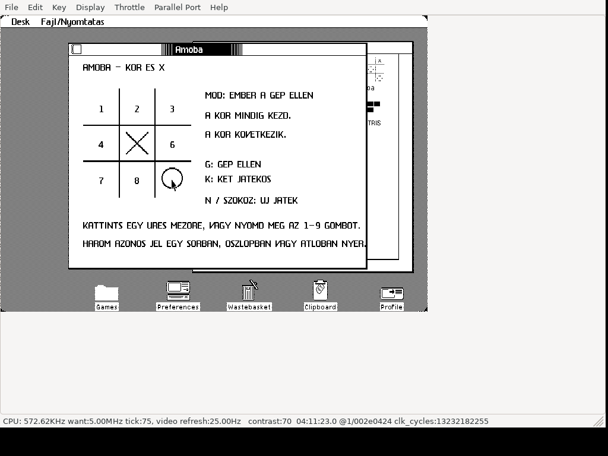

# Amoba for Apple Lisa

Hungarian 3×3 tic-tac-toe for Apple Lisa, running in a window under
Lisa Office System 3. **O always starts.** Play against the computer or with
two human players. Three identical marks in a row, column or diagonal win;
a full board without a winner is a draw.

- **1–9** or a mouse click: choose a square.
- **G**: new game against the computer (human O, computer X).
- **K**: new two-player game.
- **N / Space**: restart in the current mode.

The computer uses a precomputed optimal policy with 285 decisions.
The Lisa's Hungarian captions use unaccented characters.

## Download and run

Download **[dist/Amoba.dc42](dist/Amoba.dc42)** (use GitHub's Download raw
file button), or get the floppy from this repository's Releases page.
The image is a 400 KB tagged Lisa floppy in Disk Copy 4.2 format: **419,284
bytes**. It is an application floppy, not a boot disk.

1. Boot your own Lisa Office System 3 installation in LisaEm.
2. Insert/mount `Amoba.dc42` as the floppy disk.
3. Open the floppy and double-click the game's tool icon.
4. For installation, use LOS **Duplicate**, then drag the duplicate to a folder
   on your hard disk. Keep the floppy mounted until copying completes.

The floppy exposes one game tool; LOS support resources are hidden files.
The application has its own tool number **241**, icon and volume identity,
so it can coexist with Minesweeper and the other game. LOS permits only one
copy of the same tool per disk; replace an older version of this same game
before copying another one onto that disk.

## Source and build

- `src/M.TEXT`: final main Pascal source used for the released program.
- `src/G.TEXT`, `J.TEXT`, `D.TEXT`, `I.TEXT`: required supporting units.
- `src/A.TEXT`: alert/phrase resource source.
- [BUILD.md](BUILD.md): compiler requirements and rebuild instructions.
- [VALIDATION.md](VALIDATION.md): recorded native and host validation.
- [CREDITS.md](CREDITS.md): upstream application framework and source provenance.

This repository publishes the corrected **2026-10-06** disk image. Earlier
prototype images with conflicting tool identities or damaged page links are
not release downloads.

SHA-256: `cce3d2afc2f01397459a0cb3cb4684e2ac0a023bc937ce528dc4f8395796cdab`.
